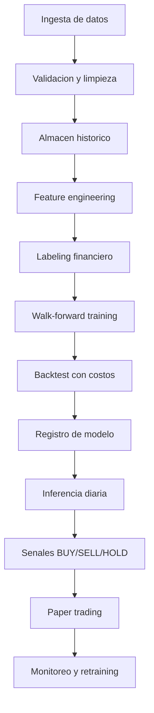

# Investigacion profesional para modelo predictivo de inversiones

Fecha: 2026-07-05  
Proyecto: Plataforma IA Inversiones

Este documento define una ruta profesional para convertir el MVP actual en una plataforma de senales de inversion con entrenamiento real de modelos, backtesting serio y decisiones `BUY`, `SELL` y `HOLD` orientadas a maximizar ganancias ajustadas por riesgo.

> Nota importante: nada en este documento garantiza ganancias ni constituye asesoria financiera. En mercados reales, el objetivo profesional no es "acertar siempre", sino construir un proceso que mida bien el riesgo, evite autoenganos estadisticos y mejore el retorno esperado despues de costos, slippage e impuestos.

## Resumen ejecutivo

La mejor ruta para este proyecto es:

1. No entrenar el modelo para "predecir precio exacto". Entrenarlo para estimar la probabilidad de que una operacion sea rentable bajo reglas claras de entrada, salida, stop-loss, take-profit y horizonte temporal.
2. Usar un pipeline supervisado con etiquetas financieras robustas, idealmente `triple-barrier labeling`, para producir etiquetas `BUY`, `SELL` y `HOLD`.
3. Empezar con modelos tabulares fuertes: LightGBM, XGBoost o CatBoost. Son mas auditables, baratos y robustos que empezar con redes profundas.
4. Validar con walk-forward, purging/embargo y backtesting con costos reales. No usar splits aleatorios.
5. Medir exito con retorno neto, Sharpe, Sortino, max drawdown, Calmar, turnover, profit factor y estabilidad out-of-sample. La accuracy sola no sirve.
6. Mantener Supabase para producto, usuarios, auth, portfolios, metadata, predicciones y datos diarios/horarios moderados. Para tick data, datos intradia pesados o analitica masiva, usar una base time-series/OLAP dedicada como Timescale, ClickHouse o QuestDB.
7. Construir primero una version profesional diaria/swing-trading antes de intentar trading intradia. El intradia exige datos mas caros, infraestructura mas delicada y control de ejecucion mucho mas estricto.

## Estado actual del proyecto

El repositorio ya contiene una base MVP:

| Area | Estado actual | Lectura |
|---|---|---|
| Backend | FastAPI en `api/main.py` | Expone activos, precios y analisis. |
| Datos | `collector/main.py` con `yfinance` | Descarga OHLCV y sube a Supabase. |
| Cerebro | `brain/logic.py` | Senales por reglas tecnicas: RSI, SMA, EMA, MACD. |
| Frontend | React + Vite en `ui/` | Dashboard con activos, grafico y senal. |
| DB | Supabase/Postgres | Tablas `assets`, `prices`, `signals`. |

La parte que debe evolucionar es `brain`: pasar de reglas fijas a un pipeline de investigacion, entrenamiento, validacion, registro e inferencia.

## Objetivo correcto del modelo

El objetivo de negocio es maximizar ganancias, pero el objetivo tecnico debe ser mas preciso:

> Maximizar retorno esperado neto ajustado por riesgo, sujeto a limites de drawdown, costos, liquidez y exposicion.

Eso implica que el modelo debe responder:

- Probabilidad de que una posicion larga gane dinero en el horizonte elegido.
- Probabilidad de que una posicion corta gane dinero, si se habilita short selling.
- Magnitud esperada del movimiento.
- Riesgo esperado: volatilidad, drawdown, perdida esperada o probabilidad de tocar stop-loss.
- Confianza suficiente para operar o abstenerse.

La salida recomendada no debe ser solo una clase, sino un objeto de decision:

```json
{
  "ticker": "AAPL",
  "timestamp": "2026-07-05T16:00:00Z",
  "horizon": "5d",
  "action": "BUY",
  "confidence": 0.67,
  "expected_return": 0.024,
  "expected_risk": 0.015,
  "position_size": 0.08,
  "stop_loss": 0.025,
  "take_profit": 0.05,
  "model_version": "lgbm_daily_v3"
}
```

## Por que no basta con predecir precios

Predecir el cierre exacto de manana suele ser menos util que predecir si existe una oportunidad operable. Un error pequeno de precio puede cambiar la direccion de una operacion; en cambio, una probabilidad calibrada permite:

- decidir si operar o mantenerse fuera;
- ajustar tamano de posicion;
- incorporar costos;
- comparar oportunidad contra riesgo;
- construir portafolios, no solo senales aisladas.

La formulacion recomendada es clasificacion probabilistica o ranking de oportunidades, no regresion pura de precio.

## Etiquetado recomendado

### Opcion MVP profesional: retorno futuro con umbral

Para una primera version:

- `BUY`: retorno futuro a `N` dias mayor que `fee + slippage + umbral`.
- `SELL`: retorno futuro menor que `-(fee + slippage + umbral)`.
- `HOLD`: retorno dentro de la zona neutra.

Ejemplo para horizonte de 5 dias:

```text
future_return_5d = close[t+5] / close[t] - 1

BUY  si future_return_5d > +1.5%
SELL si future_return_5d < -1.5%
HOLD si esta entre -1.5% y +1.5%
```

Ventaja: rapido de implementar.  
Riesgo: ignora si antes de llegar al dia 5 se toco un stop-loss o take-profit.

### Opcion recomendada: triple-barrier labeling

Para un sistema serio, usar `triple-barrier labeling`:

- Barrera superior: take-profit.
- Barrera inferior: stop-loss.
- Barrera vertical: tiempo maximo de espera.

La etiqueta depende de que barrera se toca primero:

- `BUY` o `+1`: toca take-profit antes que stop-loss.
- `SELL` o `-1`: toca stop-loss antes que take-profit, o senal short si se modela en ambos sentidos.
- `HOLD` o `0`: no hay suficiente movimiento antes del vencimiento.

Este enfoque es mas congruente con trading real porque incluye salida, riesgo y horizonte. La libreria `mlfin.py` documenta el metodo como tres barreras: superior, inferior y vertical. Fuente: [mlfin.py - Triple Barrier Method](https://mlfinpy.readthedocs.io/en/latest/Labelling.html).

### Meta-labeling

Una evolucion profesional es usar dos capas:

1. Modelo primario: propone una senal candidata, por ejemplo momentum, reversal, breakout o valor relativo.
2. Meta-modelo: decide si esa senal se debe tomar o ignorar.

Esto reduce operaciones malas y permite que el modelo sea mas conservador. Es especialmente util cuando ya existe una estrategia base y se busca filtrar entradas.

## Horizonte recomendado

Para este proyecto, recomiendo empezar con:

| Horizonte | Recomendacion | Razon |
|---|---|---|
| Diario, 3 a 10 dias | Primero | Datos mas baratos, menos ruido, ejecucion mas simple. |
| Semanal, 2 a 8 semanas | Segundo | Mejor para portafolios y menor turnover. |
| Intradia, 1 a 60 minutos | Despues | Requiere tick/minute data confiable, slippage realista y ejecucion. |
| Tick/high-frequency | No ahora | Requiere infraestructura especializada y datos caros. |

## Datos necesarios

### Minimos para v1

- OHLCV diario ajustado por splits/dividendos.
- Activos: acciones liquidas, ETFs, cripto principal.
- Calendario de mercado.
- Costos estimados por activo.
- Volatilidad historica.
- Indicadores tecnicos derivados.
- Benchmark: SPY, QQQ, BTC, etc.

### Recomendados para v2

- Datos intradia de 1h o 15m.
- VIX, tasas, DXY, rendimientos de bonos, commodities.
- Sentimiento de noticias.
- Fundamentales: earnings, revenue, margins, valuation multiples.
- Eventos corporativos: splits, dividendos, earnings dates.
- Datos cross-asset: correlaciones, beta, momentum sectorial.

### Fuentes de datos

| Fuente | Uso recomendado | Comentario |
|---|---|---|
| `yfinance` | Prototipo, investigacion local | Su propia documentacion aclara que no esta afiliado ni validado por Yahoo y que esta pensado para investigacion/educacion. Fuente: [yfinance docs](https://ranaroussi.github.io/yfinance/index.html). |
| Alpaca Market Data | Produccion inicial con equities/crypto | Ofrece datos historicos y real-time para equities, options y crypto. Fuente: [Alpaca Market Data API](https://docs.alpaca.markets/us/docs/about-market-data-api). |
| Nasdaq Data Link | Macro, fundamentales, datasets premium | Tiene APIs, SDK Python, Excel y datasets gratuitos/premium. Fuente: [Nasdaq Data Link docs](https://docs.data.nasdaq.com/). |
| Polygon/Massive | Market data profesional | Util para snapshots, quotes, trades y agregados multi-activo segun plan disponible. Fuente: [Stocks REST API](https://massive.com/docs/rest/stocks/overview). |
| FRED | Macro gratis | Tasas, inflacion, indicadores economicos. |

## Features recomendadas

### Precio y retorno

- Retornos logaritmicos: 1d, 3d, 5d, 10d, 20d.
- Momentum acumulado.
- Distancia a maximos/minimos recientes.
- Gaps.
- Rangos intradia.
- Volatilidad realizada.
- ATR.

### Indicadores tecnicos

- RSI.
- MACD.
- SMA/EMA y cruces.
- Bollinger Bands.
- Stochastic oscillator.
- ADX.
- OBV.
- Volume z-score.

### Regimen de mercado

- Tendencia del benchmark.
- Volatilidad de mercado.
- Correlacion rolling con SPY/QQQ/BTC.
- Regimen risk-on/risk-off.
- Drawdown actual del activo y del mercado.

### Cross-sectional

Para acciones/ETFs:

- Ranking de momentum relativo.
- Ranking de volatilidad.
- Ranking de volumen/liquidez.
- Beta contra benchmark.
- Sector/industria.

### Sentimiento

Para v2:

- Noticias financieras.
- Sentimiento FinBERT.
- Volumen de noticias.
- Sorpresas de earnings.
- Social sentiment solo si se puede limpiar ruido y manipulación.

## Modelos recomendados

### Baselines obligatorios

Antes de usar modelos complejos:

- Regla actual RSI/SMA/MACD.
- Buy and hold.
- Random/no-trade baseline.
- Logistic Regression regularizada.
- Random Forest simple.

Si un modelo complejo no supera estos baselines despues de costos, no debe ir a produccion.

### Modelos principales para v1

| Modelo | Recomendacion | Razon |
|---|---|---|
| LightGBM | Muy recomendado | Rapido, eficiente y fuerte para datos tabulares. Su documentacion lo describe como gradient boosting basado en arboles, con entrenamiento rapido, bajo uso de memoria y soporte para GPU/distribuido. Fuente: [LightGBM docs](https://lightgbm.readthedocs.io/). |
| XGBoost | Muy recomendado | Robusto, probado y escalable. El paper original lo describe como un sistema de tree boosting escalable usado para resultados state-of-the-art. Fuente: [XGBoost paper](https://arxiv.org/abs/1603.02754). |
| CatBoost | Recomendado si hay categoricas | Bueno con variables categoricas como sector, exchange, asset class. Fuente: [CatBoost](https://catboost.ai/). |
| Logistic Regression | Baseline | Interpretable y dificil de sobreajustar si se regulariza bien. |

### Modelos avanzados para v2/v3

| Modelo | Cuando usarlo | Advertencia |
|---|---|---|
| Temporal Fusion Transformer | Cuando haya muchas series, covariables y datos suficientes | PyTorch Forecasting lo presenta como modelo potente para forecasting multi-horizonte, pero requiere volumen de datos y tuning. Fuente: [TFT docs](https://pytorch-forecasting.readthedocs.io/en/stable/api/pytorch_forecasting.models.temporal_fusion_transformer.TemporalFusionTransformer.html). |
| LSTM/GRU | Si se desea modelar secuencias | Frecuentemente no supera GBDT en tabular financiero si los datos son limitados. |
| Ensembles | Cuando varios modelos tienen edges distintos | Cuidar sobreajuste por seleccionar demasiadas combinaciones. |
| Reinforcement Learning | No recomendado al inicio | Alto riesgo de sobreajuste y simulaciones poco realistas. |

## Validacion profesional

### Regla central

No usar `train_test_split` aleatorio en series financieras.

La documentacion oficial de scikit-learn indica que `TimeSeriesSplit` entrega indices train/test para datos ordenados en el tiempo, evitando entrenar con futuro y evaluar con pasado. Fuente: [scikit-learn TimeSeriesSplit](https://scikit-learn.org/stable/modules/generated/sklearn.model_selection.TimeSeriesSplit.html).

### Validacion minima

- Split temporal: train pasado, validation posterior, test final.
- Walk-forward validation.
- Separacion estricta por fecha.
- Features calculadas solo con informacion disponible hasta `t`.
- Labels futuras solo para entrenamiento, nunca para features.

### Validacion recomendada

- Walk-forward con ventanas rolling o expanding.
- Purged cross-validation cuando las etiquetas se traslapan en el tiempo.
- Embargo entre train y test para evitar leakage.
- Test out-of-sample final intocable.
- Paper trading antes de capital real.

### Control de overfitting

La metrica de Sharpe puede inflarse por seleccion de muchos experimentos. Bailey y Lopez de Prado proponen el Deflated Sharpe Ratio para corregir selection bias, multiple testing y no-normalidad. Fuente: [Deflated Sharpe Ratio paper](https://papers.ssrn.com/sol3/papers.cfm?abstract_id=2460551).

Tambien conviene registrar:

- numero de experimentos probados;
- cambios de features;
- cambios de etiquetas;
- cambios de hiperparametros;
- periodos descartados;
- razon de seleccion del modelo ganador.

## Backtesting serio

Un backtest debe incluir:

- Comisiones.
- Slippage.
- Spread.
- Liquidez.
- Tamano maximo por posicion.
- Rebalanceo.
- Stop-loss y take-profit.
- Delay entre senal y ejecucion.
- Survivorship bias.
- Corporate actions.
- Short constraints, si aplica.
- Capital inicial y reinversion.

Herramienta recomendada para investigacion rapida: `vectorbt`, porque trabaja sobre pandas/NumPy y esta disenado para probar muchas estrategias rapido. Fuente: [vectorbt docs](https://vectorbt.dev/).

Para ejecucion/paper trading, evaluar Alpaca, Interactive Brokers o broker especifico segun mercado.

## Metricas correctas

### No optimizar solo accuracy

Un modelo puede tener baja accuracy y ganar dinero si acierta cuando importa, o alta accuracy y perder si sus errores son grandes.

### Metricas de modelo

- Precision por clase.
- Recall por clase.
- F1 macro.
- ROC-AUC o PR-AUC si aplica.
- Calibration curve.
- Brier score para probabilidades.
- Confusion matrix por regimen de mercado.

### Metricas de trading

- CAGR.
- Retorno neto.
- Sharpe.
- Sortino.
- Max drawdown.
- Calmar ratio.
- Profit factor.
- Win rate.
- Average win / average loss.
- Turnover.
- Exposure.
- Tail risk.
- Value at Risk / Expected Shortfall.
- Estabilidad por ano, activo y regimen.

### Metrica objetivo recomendada

Para Optuna/hyperparameter search:

```text
score = annualized_return
        - lambda_drawdown * max_drawdown
        - lambda_turnover * turnover
        - lambda_instability * variance_across_folds
```

O usar una variante de Sharpe/Sortino con penalizacion por drawdown y costos.

## Pipeline recomendado



## Arquitectura propuesta en este repositorio

Estructura sugerida:

```text
brain/
  features.py          # Feature engineering sin leakage
  labeling.py          # Retornos futuros y triple-barrier
  datasets.py          # Construccion de datasets train/val/test
  models.py            # Wrappers LightGBM/XGBoost/CatBoost
  train.py             # Entrenamiento walk-forward
  backtest.py          # Simulacion con costos
  registry.py          # Guardado/carga de modelos
  inference.py         # Senales para API
  risk.py              # Sizing, stops, limites de exposicion

collector/
  providers/
    yfinance_provider.py
    alpaca_provider.py
    nasdaq_provider.py
  jobs/
    collect_daily.py
    collect_intraday.py

api/
  routers/
    assets.py
    prices.py
    signals.py
    models.py

supabase/
  migrations/
```

## Tablas recomendadas

Mantener:

- `assets`
- `prices`
- `signals`

Agregar:

| Tabla | Uso |
---|---|
| `market_calendar` | Dias/horarios validos por mercado. |
| `features_daily` | Features versionadas por activo/fecha. |
| `labels_daily` | Etiquetas generadas por horizonte/metodo. |
| `model_runs` | Experimentos, parametros, metricas, dataset hash. |
| `model_artifacts` | Ruta/version del modelo entrenado. |
| `predictions` | Probabilidades y senales generadas. |
| `backtests` | Resultados agregados de simulaciones. |
| `backtest_trades` | Operaciones simuladas. |
| `paper_trades` | Operaciones en paper trading. |
| `risk_limits` | Reglas de exposicion, max drawdown, sizing. |

## Evaluacion de Supabase

### Donde Supabase si encaja

Supabase es una buena decision para:

- Auth.
- Usuarios.
- Portafolios.
- Watchlists.
- Configuracion de estrategias.
- Senales generadas.
- Resultados agregados.
- Datos diarios/horarios moderados.
- API REST rapida via PostgREST.
- Desarrollo rapido del producto.

### Donde Supabase puede quedarse corto

Supabase no deberia ser la unica pieza si el producto crece hacia:

- tick data;
- order book;
- millones de filas diarias;
- backtests masivos;
- agregaciones intradia intensivas;
- analitica historica pesada;
- busquedas rapidas cross-sectional sobre muchos activos y horizontes.

### Supabase + TimescaleDB

Supabase documenta la extension TimescaleDB para datos time-series y explica que usa chunks por intervalos de tiempo, compresion y optimizacion para cargas write-heavy. Fuente: [Supabase TimescaleDB extension](https://supabase.com/docs/guides/database/extensions/timescaledb).

Pero la lista de extensiones de Supabase marca `timescaledb` como deprecada en Postgres 17. Fuente: [Supabase extensions overview](https://supabase.com/docs/guides/database/extensions).

Decision: Supabase sirve bien ahora, pero si se planea usar TimescaleDB a largo plazo, hay que confirmar version de Postgres y roadmap antes de depender completamente de esa extension dentro de Supabase.

### Alternativas de base de datos

| Opcion | Mejor para | Comentario |
|---|---|---|
| Supabase/Postgres | Producto, auth, metadata, datos moderados | Mantenerlo como base principal de la app. |
| Timescale/Tiger Cloud | Series temporales en ecosistema Postgres | Hypertables, compresion, continuous aggregates. Fuente: [Timescale continuous aggregates](https://www.tigerdata.com/docs/learn/continuous-aggregates). |
| ClickHouse | Analitica historica masiva y agregaciones rapidas | Su documentacion lo posiciona fuerte para time-series y analitica a escala. Fuente: [ClickHouse time-series docs](https://clickhouse.com/docs/use-cases/time-series). |
| QuestDB | Ingestion rapida, SQL time-series, casos financieros | Documenta ingestion via ILP/HTTP y SQL time-series. Fuente: [QuestDB docs](https://questdb.com/docs/). |
| Parquet + DuckDB | Research local barato y reproducible | Muy bueno para datasets de entrenamiento y snapshots versionados. |

### Recomendacion de arquitectura de datos

Para una plataforma profesional:

```text
Supabase/Postgres:
  usuarios, auth, portfolios, assets, senales, model_runs, configuracion

Data lake local/cloud:
  parquet particionado por asset_class/ticker/date

Timescale/ClickHouse/QuestDB:
  OHLCV intradia, tick data, agregaciones pesadas, research rapido

MLflow/artifact storage:
  modelos, parametros, metricas, datasets hash
```

Para la etapa inmediata: seguir con Supabase, pero disenar las interfaces para poder mover `prices` a una base time-series sin romper API ni frontend.

## Herramientas recomendadas

### Core Python

- Python 3.11 o 3.12.
- pandas.
- numpy.
- polars para datasets grandes.
- pyarrow/parquet.
- scipy.
- scikit-learn.

### Modelado

- LightGBM.
- XGBoost.
- CatBoost.
- scikit-learn.
- PyTorch/PyTorch Forecasting solo para fase avanzada.

### Optimizacion

- Optuna para hiperparametros. La documentacion lo define como framework automatico de optimizacion de hiperparametros para ML. Fuente: [Optuna docs](https://optuna.readthedocs.io/).

### Experimentos y modelos

- MLflow Tracking y Model Registry. MLflow documenta un registro centralizado con versionado, lineage, aliases, metadata y anotaciones. Fuente: [MLflow Model Registry](https://mlflow.org/docs/latest/ml/model-registry/).

### Backtesting

- vectorbt para investigacion rapida.
- backtrader si se requiere simulacion mas orientada a ordenes/eventos.
- quantstats o pyfolio-reloaded para reportes.

### Orquestacion

- Prefect para convertir scripts Python en pipelines programados con retries y monitoreo. Fuente: [Prefect docs](https://docs.prefect.io/v3/get-started).
- Dagster si se quiere una plataforma asset-centric con lineage y observabilidad. Fuente: [Dagster docs](https://docs.dagster.io/).

### Feature store y monitoreo

- Feast cuando haya necesidad de servir features historicas y online de forma consistente. Fuente: [Feast docs](https://docs.feast.dev/).
- Evidently para data drift, calidad y monitoreo de modelos. Fuente: [Evidently docs](https://docs.evidentlyai.com/introduction).

### API y producto

- FastAPI.
- Supabase.
- React.
- lightweight-charts.
- Auth y RLS de Supabase para multiusuario.

## Flujo de implementacion recomendado

### Fase 1 - Fundacion cuantitativa

Objetivo: transformar el MVP de reglas en un laboratorio reproducible.

- Crear `brain/features.py`.
- Crear `brain/labeling.py`.
- Crear datasets diarios con labels de retorno futuro.
- Agregar tablas `features_daily`, `labels_daily`, `predictions`, `model_runs`.
- Implementar backtest basico con comisiones y slippage.
- Crear baseline actual RSI/SMA/MACD como benchmark.

Resultado esperado: podemos comparar cualquier modelo contra la estrategia actual.

### Fase 2 - Primer modelo profesional

Objetivo: entrenar un modelo tabular robusto.

- Entrenar LightGBM/XGBoost para clasificacion `BUY/SELL/HOLD`.
- Usar walk-forward validation.
- Optimizar por retorno neto ajustado por riesgo, no accuracy.
- Guardar experimentos con MLflow.
- Exponer endpoint `/api/analysis/{ticker}` usando modelo versionado.

Resultado esperado: senales probabilisticas reproducibles con metrica out-of-sample.

### Fase 3 - Triple barrier y risk engine

Objetivo: alinear labels con trading real.

- Implementar triple-barrier labeling.
- Incluir stop-loss, take-profit y horizonte.
- Agregar position sizing.
- Incorporar limites por activo, asset class y drawdown.
- Backtest con reglas de ejecucion.

Resultado esperado: el modelo predice oportunidades operables, no solo direccion.

### Fase 4 - Data profesional

Objetivo: mejorar calidad y cobertura.

- Mantener `yfinance` solo para prototipo.
- Integrar Alpaca/Nasdaq/Polygon segun presupuesto.
- Guardar snapshots en Parquet.
- Evaluar Timescale/ClickHouse/QuestDB si crece intradia.
- Agregar calendario de mercado y corporate actions.

Resultado esperado: datasets confiables y auditables.

### Fase 5 - Paper trading y monitoreo

Objetivo: comprobar comportamiento fuera del laboratorio.

- Generar senales diarias automaticamente.
- Guardar predicciones antes de conocer el resultado.
- Ejecutar paper trades.
- Comparar prediccion vs resultado real.
- Monitorear drift con Evidently.
- Reentrenar solo con politica clara.

Resultado esperado: evidencia real de robustez antes de usar capital.

## Criterios de salida a produccion

No operar capital real hasta cumplir:

- Minimo 6 a 12 meses de paper trading o suficiente muestra fuera de muestra.
- Backtest con costos, slippage y delay realistas.
- Max drawdown aceptable.
- Resultados estables por periodo, no concentrados en una sola ventana.
- No depender de un solo activo.
- Modelo registrado y versionado.
- Predicciones guardadas antes del resultado.
- Plan de apagado si el modelo entra en drawdown o drift.
- Alertas por datos faltantes o anormales.
- Revision manual de operaciones grandes.

## Politica de decisiones BUY/SELL/HOLD

Ejemplo inicial:

```text
if p_buy > 0.60 and expected_return > costs + risk_buffer:
    action = "BUY"
elif p_sell > 0.60 and expected_return < -(costs + risk_buffer):
    action = "SELL"
else:
    action = "HOLD"
```

Agregar filtros:

- No comprar si volumen/liquidez es insuficiente.
- No operar si spread estimado es demasiado alto.
- No operar si volatilidad excede limite.
- Reducir posicion si el mercado esta en drawdown severo.
- Bloquear operaciones durante eventos de earnings si el modelo no fue entrenado para eso.

## Riesgos principales

| Riesgo | Mitigacion |
|---|---|
| Look-ahead bias | Features solo con datos disponibles hasta `t`. |
| Leakage por labels traslapadas | Purging y embargo. |
| Overfitting | Walk-forward, test intocable, Deflated Sharpe, registro de experimentos. |
| Datos pobres | Proveedor profesional y validacion de calidad. |
| Costos ignorados | Backtest siempre neto de comisiones/slippage/spread. |
| Cambios de regimen | Monitoreo por regimen y retraining controlado. |
| Optimizar accuracy | Optimizar retorno ajustado por riesgo. |
| Sobreoperar | Penalizar turnover y exigir umbral minimo de edge. |
| Dependencia de Supabase para todo | Separar app DB, data lake y motor time-series cuando escale. |

## Recomendacion final

La ruta mas profesional y pragmatica para este proyecto es:

1. Mantener Supabase como base de producto.
2. Crear un pipeline ML reproducible en `brain`.
3. Empezar con LightGBM/XGBoost y features diarios.
4. Implementar backtesting serio antes de cambiar la API.
5. Pasar de labels simples a triple-barrier.
6. Registrar experimentos con MLflow.
7. Guardar datasets en Parquet para reproducibilidad.
8. Integrar un proveedor de datos profesional antes de tomar decisiones reales.
9. Evaluar Timescale/ClickHouse/QuestDB cuando el volumen de datos lo justifique.
10. Usar paper trading como filtro final antes de capital real.

La prioridad no debe ser "usar el modelo mas avanzado", sino construir un sistema que no se engane a si mismo. En finanzas, esa es la diferencia entre un dashboard atractivo y una plataforma seria.

## Fuentes principales

- [scikit-learn TimeSeriesSplit](https://scikit-learn.org/stable/modules/generated/sklearn.model_selection.TimeSeriesSplit.html)
- [Deflated Sharpe Ratio - Bailey y Lopez de Prado](https://papers.ssrn.com/sol3/papers.cfm?abstract_id=2460551)
- [mlfin.py - Triple Barrier Method](https://mlfinpy.readthedocs.io/en/latest/Labelling.html)
- [LightGBM documentation](https://lightgbm.readthedocs.io/)
- [XGBoost paper](https://arxiv.org/abs/1603.02754)
- [CatBoost](https://catboost.ai/)
- [PyTorch Forecasting - Temporal Fusion Transformer](https://pytorch-forecasting.readthedocs.io/en/stable/api/pytorch_forecasting.models.temporal_fusion_transformer.TemporalFusionTransformer.html)
- [vectorbt documentation](https://vectorbt.dev/)
- [MLflow Model Registry](https://mlflow.org/docs/latest/ml/model-registry/)
- [Optuna documentation](https://optuna.readthedocs.io/)
- [yfinance documentation and disclaimer](https://ranaroussi.github.io/yfinance/index.html)
- [Alpaca Market Data API](https://docs.alpaca.markets/us/docs/about-market-data-api)
- [Nasdaq Data Link documentation](https://docs.data.nasdaq.com/)
- [Supabase TimescaleDB extension](https://supabase.com/docs/guides/database/extensions/timescaledb)
- [Supabase extensions overview](https://supabase.com/docs/guides/database/extensions)
- [Timescale continuous aggregates](https://www.tigerdata.com/docs/learn/continuous-aggregates)
- [ClickHouse time-series documentation](https://clickhouse.com/docs/use-cases/time-series)
- [QuestDB documentation](https://questdb.com/docs/)
- [Prefect documentation](https://docs.prefect.io/v3/get-started)
- [Dagster documentation](https://docs.dagster.io/)
- [Feast documentation](https://docs.feast.dev/)
- [Evidently documentation](https://docs.evidentlyai.com/introduction)
