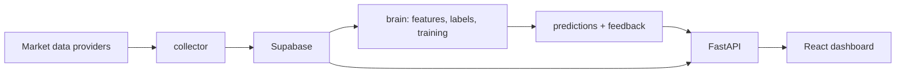

# IA Inversiones


Plataforma experimental para investigacion, entrenamiento y evaluacion de modelos de decision de inversion. El objetivo es convertir datos historicos de mercado en senales auditables de **comprar**, **vender** o **mantener**, siempre acompanadas por confianza, riesgo, probabilidades y trazabilidad del modelo.

> Este proyecto no es asesoria financiera. Las senales deben validarse con backtesting, gestion de riesgo y supervision humana antes de cualquier uso real.

## Estado Actual

| Area | Estado |
| --- | --- |
| Frontend | Dashboard React con activos, grafico, senal, riesgo, probabilidades, backtests e historial de predicciones. |
| API | FastAPI con endpoints para activos, precios, analisis, backtests e historial de predicciones. |
| Datos | Supabase como fuente principal; modo demo local cuando Supabase no esta disponible. |
| ML | Pipeline base para features, labels, entrenamiento, inferencia, feedback y backtesting. |
| Calidad | Suite de pruebas para API, collector, repositorio Supabase y pipeline de modelo. |

## Experiencia

La interfaz esta pensada como una consola operativa, no como landing page. El usuario ve primero:

- Activo seleccionado y clase de activo.
- Senal actual: `BUY`, `SELL` o `HOLD`.
- Confianza y horizonte.
- Grafico historico de precio.
- Gestion de riesgo: posicion, stop, objetivo y bloqueos.
- Probabilidades por accion.
- Backtests persistidos por instrumento y version de modelo.
- Metadatos del modelo o indicador que genero la lectura.
- Historial reciente para auditar predicciones y feedback.

Cuando la API no puede conectarse a Supabase, la aplicacion muestra `Datos demo` para evitar confundir datos sinteticos con datos reales.

## Arquitectura



## Estructura

| Ruta | Proposito |
| --- | --- |
| `api/` | API HTTP con FastAPI. |
| `brain/` | Features, labeling, entrenamiento, inferencia, feedback y backtesting. |
| `collector/` | Descarga y carga de historicos hacia Supabase. |
| `supabase/migrations/` | Esquema SQL para datos, modelos, predicciones y feedback. |
| `ui/` | Frontend React + Vite + Tailwind. |
| `tests/` | Pruebas automatizadas del sistema. |
| `INVESTIGACION_MODELO_PREDICTIVO.md` | Guia de investigacion y hoja de ruta tecnica. |

## Configuracion

1. Crea una copia local de variables:

```bash
cp .env.example .env
```

2. Completa tus credenciales:

```env
APP_ENV=development
ALLOW_DEMO_FALLBACK=true
API_CORS_ORIGINS=*
SUPABASE_URL=https://tu-proyecto.supabase.co
SUPABASE_KEY=tu-clave-server-side-local
VITE_API_BASE_URL=http://localhost:8000/api
```

`SUPABASE_KEY` se usa solo en backend, ingestion, entrenamiento e inferencia. No debe exponerse en el frontend ni subirse al repositorio; para ambientes con RLS activado usa una clave server-side creada para el pipeline.

Variables de entorno principales:

| Variable | Uso |
| --- | --- |
| `APP_ENV` | Entorno de ejecucion: `development`, `staging`, `production` o `test`. |
| `ALLOW_DEMO_FALLBACK` | Permite servir datos demo si Supabase no esta disponible. Por defecto es `true` fuera de produccion y `false` en `production`. |
| `API_CORS_ORIGINS` | Lista separada por comas de origenes permitidos por la API. |
| `VITE_API_BASE_URL` | URL base que usa el frontend para llamar a la API. |

3. Instala dependencias:

```bash
pip install -r requirements.txt
cd ui
npm install
```

## Ejecucion Local

API:

```bash
python -m uvicorn api.main:app --host 127.0.0.1 --port 8000
```

Frontend:

```bash
cd ui
npm run dev -- --host 127.0.0.1 --port 5173
```

Abre [http://127.0.0.1:5173](http://127.0.0.1:5173).

## Verificacion

Backend y pipeline:

```bash
pytest tests
```

Frontend:

```bash
cd ui
npm run lint
npm run build
```

Conexion con Supabase:

```bash
python -c "from collector.supabase_repository import SupabaseConfig, SupabaseRepository; r=SupabaseRepository(SupabaseConfig.from_env()); print(len(r.get_assets()))"
```

Esquema ML en Supabase:

```bash
python -m collector.schema_check
```

Si falta alguna relacion, aplica `supabase/migrations/20260705000100_ml_pipeline_tables.sql` desde el SQL Editor de Supabase y vuelve a ejecutar el chequeo.

Si falla DNS o red en desarrollo, la API activa el modo demo local para que el dashboard siga siendo navegable. En produccion, deja `ALLOW_DEMO_FALLBACK=false` para que los fallos de datos se reporten como errores reales en lugar de mostrarse como lecturas sinteticas.

## Flujo de Trabajo del Modelo

1. Descargar historicos de mercado por instrumento.
2. Cargar precios normalizados a Supabase.
3. Materializar features tecnicos y labels.
4. Entrenar modelos candidatos con validacion walk-forward.
5. Evaluar out-of-sample con backtesting, baselines y barrido de umbrales.
6. Guardar `model_runs`, predicciones y metadata.
7. Evaluar feedback de predicciones previas.
8. Servir la decision en la API con riesgo y trazabilidad.

## Jobs Operativos

Para actualizar precios y materializar datasets:

```bash
python -m collector.run_market_data_job --assets-file config/assets.core.json --feature-sets technical_v2 --out reports/market_data_job.json
```

Para materializar un activo ya cargado en Supabase sin descargar precios:

```bash
python -m collector.run_market_data_job --skip-collection --tickers BTC-USD --feature-sets technical_v2 --out reports/market_data_job_btc.json
```

El job de datos:

- descarga precios para los activos configurados;
- guarda OHLCV normalizado en Supabase;
- materializa features y labels;
- reporta errores por activo sin detener todo el proceso, salvo que uses `--fail-fast`.

Para generar predicciones latest desde los modelos promovidos:

```bash
python -m brain.run_inference_job --out reports/inference_job_latest.json
```

El job:

- busca `model_runs` creados por promocion de candidatos;
- identifica su `target_ticker`;
- carga el artefacto `.joblib`;
- genera la prediccion mas reciente desde features materializadas;
- aplica reglas de riesgo;
- guarda la prediccion en Supabase.

Puede filtrarse por version:

```bash
python -m brain.run_inference_job --model-name extra_trees --model-version promoted_smoke_20260706
```

### Scheduler Externo

El repositorio incluye `.github/workflows/operational-jobs.yml` para ejecutar jobs desde GitHub Actions:

- `schedule`: corre todos los dias a las 06:20 UTC y actualiza datos/features con `config/assets.core.json`.
- `workflow_dispatch`: permite lanzar `market_data`, `inference` o `full` manualmente.
- `tickers`: permite limitar una corrida a instrumentos concretos, por ejemplo `BTC-USD,AAPL`.
- `skip_collection`: materializa features y labels usando precios ya guardados.

Configura estos GitHub Secrets antes de activar el workflow:

```text
SUPABASE_URL
SUPABASE_KEY
```

El workflow corre con `APP_ENV=production` y `ALLOW_DEMO_FALLBACK=false`, por lo que falla rapido si Supabase o el esquema no estan disponibles. Los reportes JSON se suben como artifacts de la ejecucion, no se versionan en el repositorio.

## Seguridad Para Repos Publicos

- No publiques `.env`.
- Usa `.env.example` para documentar variables.
- Usa claves server-side solo en procesos privados de backend/pipeline, nunca en el frontend.
- Revisa que las credenciales de Supabase no queden en commits.
- Rota cualquier credencial que haya sido expuesta previamente.

## Roadmap

- Agregar autenticacion y perfiles de riesgo por usuario.
