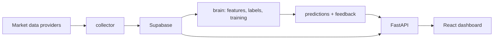

# IA Inversiones


Plataforma experimental para investigacion, entrenamiento y evaluacion de modelos de decision de inversion. El objetivo es convertir datos historicos de mercado en senales auditables de **comprar**, **vender** o **mantener**, siempre acompanadas por confianza, riesgo, probabilidades y trazabilidad del modelo.

> Este proyecto no es asesoria financiera. Las senales deben validarse con backtesting, gestion de riesgo y supervision humana antes de cualquier uso real.

## Estado Actual

| Area | Estado |
| --- | --- |
| Frontend | Dashboard React con activos, grafico, senal, riesgo, probabilidades y estado del modelo. |
| API | FastAPI con endpoints para activos, precios y analisis. |
| Datos | Supabase como fuente principal; modo demo local cuando Supabase no esta disponible. |
| ML | Pipeline base para features, labels, entrenamiento, inferencia, feedback y backtesting. |
| Calidad | Suite de pruebas para API, collector, repositorio Supabase y pipeline de modelo. |

## Experiencia

La interfaz esta pensada como una consola operativa, no como landing page. El usuario ve primero:

- Activo seleccionado y clase de activo.
- Senal actual: `BUY`, `SELL` o `HOLD`.
- Confianza y horizonte.
- Grafico historico de precio.
- Gestion de riesgo: posicion, stop, objetivo y bloqueos.
- Probabilidades por accion.
- Metadatos del modelo o indicador que genero la lectura.

Cuando la API no puede conectarse a Supabase, la aplicacion muestra `Datos demo` para evitar confundir datos sinteticos con datos reales.

## Arquitectura



## Estructura

| Ruta | Proposito |
| --- | --- |
| `api/` | API HTTP con FastAPI. |
| `brain/` | Features, labeling, entrenamiento, inferencia, feedback y backtesting. |
| `collector/` | Descarga y carga de historicos hacia Supabase. |
| `supabase/migrations/` | Esquema SQL para datos, modelos, predicciones y feedback. |
| `ui/` | Frontend React + Vite + Tailwind. |
| `tests/` | Pruebas automatizadas del sistema. |
| `INVESTIGACION_MODELO_PREDICTIVO.md` | Guia de investigacion y hoja de ruta tecnica. |

## Configuracion

1. Crea una copia local de variables:

```bash
cp .env.example .env
```

2. Completa tus credenciales:

```env
SUPABASE_URL=https://tu-proyecto.supabase.co
SUPABASE_KEY=tu-clave-server-side-local
```

`SUPABASE_KEY` se usa solo en backend, ingestion, entrenamiento e inferencia. No debe exponerse en el frontend ni subirse al repositorio; para ambientes con RLS activado usa una clave server-side creada para el pipeline.

3. Instala dependencias:

```bash
pip install -r requirements.txt
cd ui
npm install
```

## Ejecucion Local

API:

```bash
python -m uvicorn api.main:app --host 127.0.0.1 --port 8000
```

Frontend:

```bash
cd ui
npm run dev -- --host 127.0.0.1 --port 5173
```

Abre [http://127.0.0.1:5173](http://127.0.0.1:5173).

## Verificacion

Backend y pipeline:

```bash
pytest tests
```

Frontend:

```bash
cd ui
npm run lint
npm run build
```

Conexion con Supabase:

```bash
python -c "from collector.supabase_repository import SupabaseConfig, SupabaseRepository; r=SupabaseRepository(SupabaseConfig.from_env()); print(len(r.get_assets()))"
```

Esquema ML en Supabase:

```bash
python -m collector.schema_check
```

Si falta alguna relacion, aplica `supabase/migrations/20260705000100_ml_pipeline_tables.sql` desde el SQL Editor de Supabase y vuelve a ejecutar el chequeo.

Si falla DNS o red, la API activa el modo demo local para que el dashboard siga siendo navegable.

## Flujo de Trabajo del Modelo

1. Descargar historicos de mercado por instrumento.
2. Cargar precios normalizados a Supabase.
3. Materializar features tecnicos y labels.
4. Entrenar modelos con validacion walk-forward.
5. Evaluar out-of-sample con backtesting y baselines.
6. Guardar `model_runs`, predicciones y metadata.
7. Evaluar feedback de predicciones previas.
8. Servir la decision en la API con riesgo y trazabilidad.

## Seguridad Para Repos Publicos

- No publiques `.env`.
- Usa `.env.example` para documentar variables.
- Usa claves server-side solo en procesos privados de backend/pipeline, nunca en el frontend.
- Revisa que las credenciales de Supabase no queden en commits.
- Rota cualquier credencial que haya sido expuesta previamente.

## Roadmap

- Agregar pantalla de auditoria de predicciones historicas.
- Mostrar backtests por instrumento y version de modelo.
- Integrar jobs programados de ingestion e inferencia.
- Separar modo demo, staging y produccion por configuracion.
- Agregar autenticacion y perfiles de riesgo por usuario.
